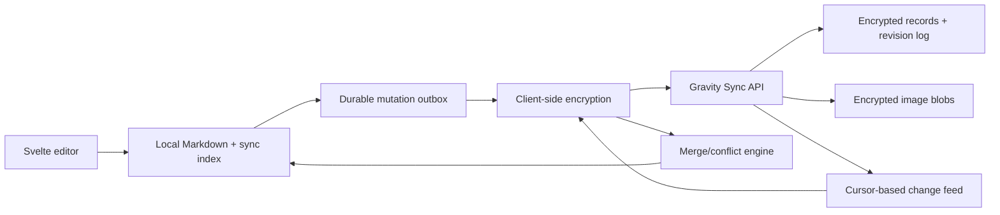

# Cross-device sync design

Gravity does not sync today. This document describes the recommended implementation: optional, local-first, encrypted synchronization that keeps every device useful offline and never silently overwrites a note.

## Product principles

1. Local saves remain the primary writing path. Opening or saving a note must not wait for the network.
2. Sync is opt-in. Gravity continues to work without an account.
3. Plain Markdown remains the user's durable local format.
4. The service stores encrypted note/image payloads, not readable note content.
5. Conflicts preserve both versions when an automatic merge is unsafe.
6. Deletions are recoverable for a retention period.

## Why not simply put the notes folder in iCloud Drive?

A user-selected iCloud Drive, Dropbox, or OneDrive folder can be an advanced bring-your-own-sync option, but it is not a reliable default:

- It does not give the same experience across Windows, Linux, macOS, and iOS.
- iOS security-scoped folder access and background execution are constrained.
- Providers can create conflict copies without application-level context.
- Images, deletes, and concurrent edits need coordination.
- Moving the only local notes folder into a provider-controlled location raises data-loss and offline-availability risks.

iCloud/CloudKit alone would also make the main sync implementation Apple-specific. Gravity should use a provider-neutral protocol if Windows and iPhone are meant to share notes.

## Recommended architecture



Each installation has:

- the existing local `notes/` and `images/` directories;
- a small SQLite sync index containing revisions, hashes, tombstones, cursors, and the durable outbox;
- a random device ID;
- an account master key stored through the platform secure credential store.

The cloud service can be implemented with Supabase Auth/Postgres/Storage for the first production version, while Gravity talks to a small provider-neutral HTTPS API. That boundary avoids coupling the app's sync protocol directly to a vendor SDK.

## Record model

Existing note IDs remain valid and become stable cross-device IDs. New notes should use UUIDv7 IDs once sync ships.

```text
NoteRecord
  id                 stable note ID
  owner_id           authenticated account
  revision           server-assigned monotonically increasing revision
  base_revision      revision the client edited
  ciphertext         encrypted Markdown and logical metadata
  content_hash       hash of ciphertext for idempotency
  modified_at        server timestamp
  modified_by        device ID
  deleted_at         tombstone timestamp or null
```

Images use a content-addressed ID derived from their plaintext hash, are encrypted independently, and are uploaded once. The encrypted note payload contains its image references.

The SQLite index stores the last acknowledged revision and an encrypted merge base for each note. Sync metadata should not be inserted into the visible Markdown body.

## Save and sync flow

1. Autosave atomically writes the Markdown file exactly as it does today.
2. In the same logical operation, Gravity records an idempotent mutation in the SQLite outbox.
3. A sync worker encrypts and uploads queued mutations when connectivity is available.
4. The server accepts a mutation when `base_revision` matches the current revision.
5. The client pulls changes after its last cursor, decrypts them, and applies them through atomic local writes.
6. A mutation leaves the outbox only after the server acknowledges it.

Sync runs after local saves, on foreground/resume, after network recovery, and when the user requests it. iOS background execution is opportunistic; foreground sync must be sufficient for correctness.

## Conflicts

If two devices edit the same base revision:

- A change on only one side wins automatically.
- Non-overlapping Markdown edits use a three-way merge against the stored base.
- If the merge contains overlapping edits or cannot be proven safe, Gravity keeps the local note and creates a sibling `Conflicted copy from <device>` note containing the remote version.
- Deletes are tombstones, retained for at least 30 days. Editing a note after a remote delete restores it as a new revision instead of discarding the edit.

The server never uses last-write-wins for note bodies.

## Authentication and encryption

A practical account flow is email magic link plus Sign in with Apple on iOS. Authentication proves account ownership but does not reveal the note encryption key to the service.

For end-to-end encryption:

1. The first device generates a random account master key.
2. Notes and images are encrypted with per-record keys using an authenticated cipher.
3. Record keys are wrapped by the account master key.
4. The master key is stored locally in Keychain on Apple platforms and the OS credential vault on Windows.
5. A user-held recovery secret wraps a copy of the master key for adding devices and recovery.

Losing every trusted device and the recovery secret must mean the service cannot recover the notes. The onboarding and recovery UI must state this clearly.

## API surface

The app needs a small, versioned protocol:

```text
POST /v1/sync/push       idempotent batch of note/image mutations
GET  /v1/sync/pull       changes after an opaque cursor
POST /v1/blobs           resumable encrypted image upload
GET  /v1/blobs/{id}      encrypted image download
GET  /v1/account/devices trusted devices and last-seen state
DELETE /v1/account/devices/{id}
```

Rate limits, payload limits, audit events, and server-side row ownership checks apply even though payloads are encrypted.

## Rollout

### Phase 1 — sync-ready local model

- Add UUIDv7 generation for new notes.
- Add SQLite metadata/outbox without changing Markdown contents.
- Model tombstones and import all existing notes.
- Add deterministic tests for restart, duplicate delivery, and failed writes.

### Phase 2 — account and encrypted transport

- Add authentication and secure key storage.
- Implement push/pull cursors, encryption, images, and manual Sync Now.
- Add settings for sync status, last success, errors, devices, and recovery.

### Phase 3 — conflict and reliability testing

- Add three-way Markdown merge and conflict copies.
- Test airplane mode, clock skew, rapid edits, process termination, duplicate requests, server rollback, and two-device deletion/edit races.
- Run a private beta with server backups and restore drills.

### Phase 4 — production

- Publish privacy policy and App Privacy disclosures.
- Add account deletion and data export.
- Monitor protocol health without collecting note contents.
- Keep sync disabled by default until the user explicitly enables it.

## Decision still required

Before implementation, choose:

- hosted Supabase versus a separately operated API/database;
- whether end-to-end encryption is mandatory for the first sync beta;
- account and recovery UX;
- storage quotas and any paid plan;
- retention period for tombstones and account backups.

The recommended choice is a provider-neutral API backed initially by Supabase, with end-to-end encryption included before public release rather than retrofitted after users have uploaded readable notes.
